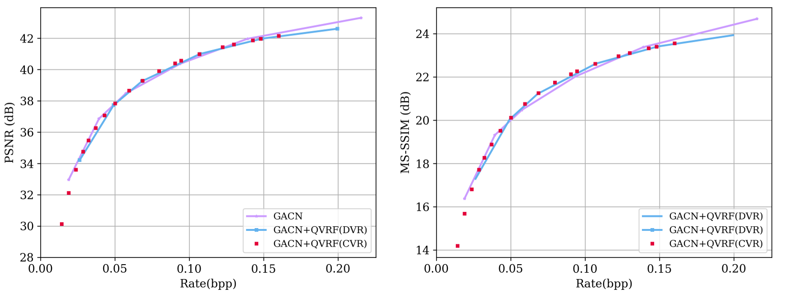

# Learned Focused Plenoptic Image Compression with Microimage Preprocessing and Global Attention + QVRF: A Quantization-error-aware variable rate framework for learned image compression 

Pytorch implementation of the paper "Learned Focused Plenoptic Image Compression with Microimage Preprocessing and Global Attention" with variable rate techniche of "QVRF: A Quantization-error-aware variable rate framework for learned image compression"

## Related links
 * CompressAI: https://github.com/InterDigitalInc/CompressAI
 * SADN：https://github.com/VincentChandelier/SADN
 * QVRF：https://github.com/bytedance/QRAF
 
## Installation
Install [CompressAI](https://github.com/InterDigitalInc/CompressAI) and the packages required for development.
```bash
conda create -n SADN+QVRF python=3.9
conda activate FPIcompress
pip install compressai==1.1.5
pip install ptflops
pip install einops
pip install tensorboardX
```
## Usage

[VariableRateCheckpoint](https://drive.google.com/file/d/1ZKmgrAtL6rdYQAoWmiTNUF11E0090Hlr/view?usp=sharing)
### Evaluation
To evaluate a trained model, the evaluation script is:
```bash
python3 Inference.py --dataset ./dataset/FullTest  --s 2 -p ./PLConvSTE.pth.tar --patch 384 --factormode 0 --factor 0
```
More details can refer https://github.com/bytedance/QRAF

## Results
RD results on 20 test images



## Citation
```

@article{tong2023qvrf,
  title={QVRF: A Quantization-error-aware Variable Rate Framework for Learned Image Compression},
  author={Tong, Kedeng and Wu, Yaojun and Li, Yue and Zhang, Kai and Zhang, Li and Jin, Xin},
  journal={arXiv preprint arXiv:2303.05744},
  year={2023}
}
```
